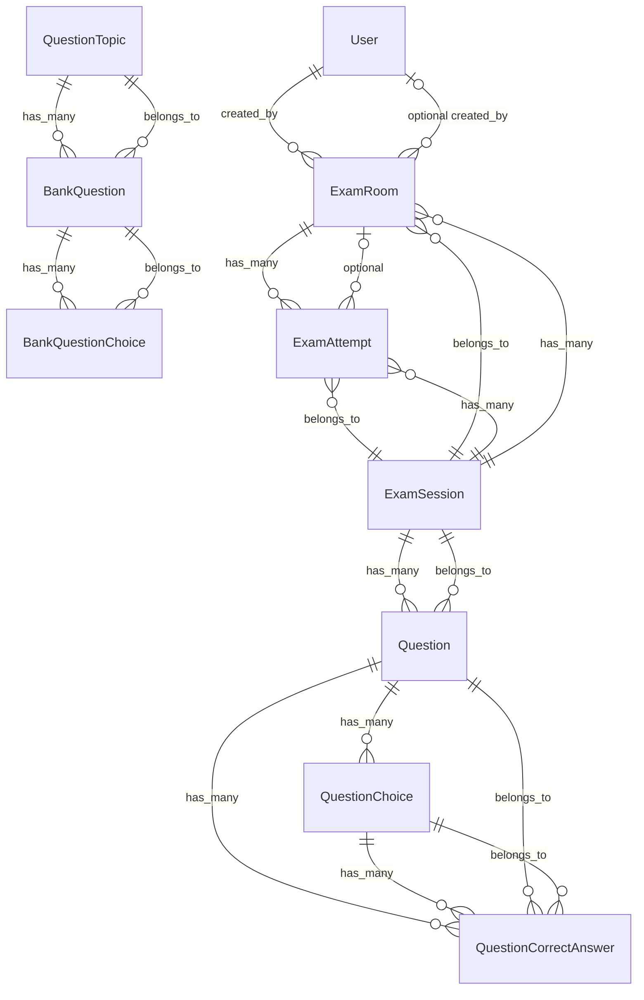

# C4 Code-Level Documentation: app-models

## 1. Overview Section

| Attribute | Value |
|-----------|-------|
| **Name** | app-models |
| **Description** | ActiveRecord models for a Ruby exam prep application: users, question banks, exam sessions, exam rooms, and exam attempts. |
| **Location** | `src/app/models` |
| **Language** | Ruby |
| **Purpose** | Defines domain entities, associations, validations, and business logic for exam creation, scheduling, taking, and scoring. |

---

## 2. Code Elements Section

### 2.1 ApplicationRecord

| Attribute | Value |
|-----------|-------|
| **Class name** | `ApplicationRecord` |
| **Location** | [src/app/models/application_record.rb](src/app/models/application_record.rb) |
| **Description** | Base class for all ActiveRecord models. Marks itself as `primary_abstract_class` so Rails does not treat it as a table-backed model. |

**Methods:**
- Inherits from `ActiveRecord::Base`; no custom methods.

**Dependencies:**
- **External:** `ActiveRecord::Base` (Rails)

---

### 2.2 User

| Attribute | Value |
|-----------|-------|
| **Class name** | `User` |
| **Location** | [src/app/models/user.rb](src/app/models/user.rb) |
| **Description** | User model with roles (user/host). Hosts create exam rooms; users take exams. |

**Associations:**
| Association | Type | Target | Options |
|-------------|------|--------|---------|
| `created_exam_rooms` | `has_many` | `ExamRoom` | `class_name: "ExamRoom", foreign_key: "created_by_id", dependent: :nullify` |

**Validations:**
- `email`: presence, uniqueness, format via `URI::MailTo::EMAIL_REGEXP`
- `role`: presence, inclusion in `%w[user host]`
- `password`: length ≥ 6, `allow_nil: true` (for updates)

**Methods:**

| Method | Signature | Returns | Description |
|--------|-----------|---------|-------------|
| `host?` | `def host?` | `Boolean` | `true` if `role == "host"` |
| `user?` | `def user?` | `Boolean` | `true` if `role == "user"` |

**Dependencies:**
- **Internal:** `ApplicationRecord`, `ExamRoom`
- **External:** `ActiveRecord::Base`, `ActiveModel::SecurePassword` (via `has_secure_password`), `URI::MailTo`, `bcrypt` (via Rails)

---

### 2.3 QuestionTopic

| Attribute | Value |
|-----------|-------|
| **Class name** | `QuestionTopic` |
| **Location** | [src/app/models/question_topic.rb](src/app/models/question_topic.rb) |
| **Description** | Topic/category for bank questions (e.g. "Variables", "Polymorphism"). |

**Associations:**
| Association | Type | Target | Options |
|-------------|------|--------|---------|
| `bank_questions` | `has_many` | `BankQuestion` | `dependent: :destroy` |

**Validations:**
- `key`: presence, uniqueness
- `name`: presence

**Dependencies:**
- **Internal:** `ApplicationRecord`, `BankQuestion`
- **External:** `ActiveRecord::Base`

---

### 2.4 BankQuestion

| Attribute | Value |
|-----------|-------|
| **Class name** | `BankQuestion` |
| **Location** | [src/app/models/bank_question.rb](src/app/models/bank_question.rb) |
| **Description** | Question template in the bank. Copied into exam sessions via `CreateExamFromBankService`. |

**Associations:**
| Association | Type | Target | Options |
|-------------|------|--------|---------|
| `question_topic` | `belongs_to` | `QuestionTopic` | — |
| `bank_question_choices` | `has_many` | `BankQuestionChoice` | `dependent: :destroy` |

**Validations:**
- `question_type`: presence, inclusion in `%w[single multiple]`
- `body`: presence

**Schema attributes (from db/schema.rb):** `body`, `explanation`, `question_topic_id`, `question_type`, `created_at`, `updated_at`

**Dependencies:**
- **Internal:** `ApplicationRecord`, `QuestionTopic`, `BankQuestionChoice`
- **External:** `ActiveRecord::Base`

---

### 2.5 BankQuestionChoice

| Attribute | Value |
|-----------|-------|
| **Class name** | `BankQuestionChoice` |
| **Location** | [src/app/models/bank_question_choice.rb](src/app/models/bank_question_choice.rb) |
| **Description** | Choice option for a bank question. `is_correct` marks correct answers. |

**Associations:**
| Association | Type | Target | Options |
|-------------|------|--------|---------|
| `bank_question` | `belongs_to` | `BankQuestion` | — |

**Validations:**
- `choice_key`: presence
- `label`: presence

**Schema attributes:** `bank_question_id`, `choice_key`, `label`, `is_correct`, `created_at`, `updated_at`

**Dependencies:**
- **Internal:** `ApplicationRecord`, `BankQuestion`
- **External:** `ActiveRecord::Base`

---

### 2.6 ExamSession

| Attribute | Value |
|-----------|-------|
| **Class name** | `ExamSession` |
| **Location** | [src/app/models/exam_session.rb](src/app/models/exam_session.rb) |
| **Description** | Exam instance with questions. Can have multiple rooms and attempts. |

**Associations:**
| Association | Type | Target | Options |
|-------------|------|--------|---------|
| `questions` | `has_many` | `Question` | `dependent: :destroy` |
| `exam_attempts` | `has_many` | `ExamAttempt` | `dependent: :destroy` |
| `exam_rooms` | `has_many` | `ExamRoom` | `dependent: :destroy` |

**Validations:**
- `hash_id`: presence, uniqueness

**Methods:**

| Method | Signature | Returns | Description |
|--------|-----------|---------|-------------|
| `score_submissions` | `def score_submissions(submissions)` | `Hash` | Scores user submissions against the answer key. |

**`score_submissions` details:**
- **Parameter:** `submissions` — `Array<Hash>`; each entry: `{ question_id: id, answers: "A" or ["A","B"] }`
- **Returns:** `{ score: Integer, total: Integer, details: Array<Hash> }`
- **Details entry:** `{ question_id, correct, user_answers, correct_answers, description, topic_key, topic_name }`

**Dependencies:**
- **Internal:** `ApplicationRecord`, `Question`, `ExamAttempt`, `ExamRoom`
- **External:** `ActiveRecord::Base`

---

### 2.7 Question

| Attribute | Value |
|-----------|-------|
| **Class name** | `Question` |
| **Location** | [src/app/models/question.rb](src/app/models/question.rb) |
| **Description** | Question belonging to an exam session. Has choices and correct answers. |

**Associations:**
| Association | Type | Target | Options |
|-------------|------|--------|---------|
| `exam_session` | `belongs_to` | `ExamSession` | — |
| `question_choices` | `has_many` | `QuestionChoice` | `dependent: :destroy` |
| `question_correct_answers` | `has_many` | `QuestionCorrectAnswer` | `dependent: :destroy` |
| `correct_choices` | `has_many` (through) | `QuestionChoice` | `through: :question_correct_answers, source: :question_choice` |

**Validations:**
- `question_type`: presence, inclusion in `%w[single multiple]`
- `body`: presence

**Scopes:**
| Scope | Definition | Description |
|-------|-------------|-------------|
| `single` | `where(question_type: "single")` | Single-choice questions |
| `multiple` | `where(question_type: "multiple")` | Multiple-choice questions |

**Methods:**

| Method | Signature | Returns | Description |
|--------|-----------|---------|-------------|
| `correct_choice_keys` | `def correct_choice_keys` | `Array<String>` | Sorted choice keys (A, B, C, D) for correct answers |
| `correct?` | `def correct?(user_choice_keys)` | `Boolean` | Compares user answers to correct answers, normalizing strings and case |

**Dependencies:**
- **Internal:** `ApplicationRecord`, `ExamSession`, `QuestionChoice`, `QuestionCorrectAnswer`
- **External:** `ActiveRecord::Base`, `Array` (for `Array.wrap`)

---

### 2.8 QuestionChoice

| Attribute | Value |
|-----------|-------|
| **Class name** | `QuestionChoice` |
| **Location** | [src/app/models/question_choice.rb](src/app/models/question_choice.rb) |
| **Description** | Choice option for an exam question. |

**Associations:**
| Association | Type | Target | Options |
|-------------|------|--------|---------|
| `question` | `belongs_to` | `Question` | — |
| `question_correct_answers` | `has_many` | `QuestionCorrectAnswer` | `dependent: :destroy` |

**Validations:**
- `choice_key`: presence, format `/\A[A-Za-z]\z/` (single letter A–Z)
- `label`: presence

**Dependencies:**
- **Internal:** `ApplicationRecord`, `Question`, `QuestionCorrectAnswer`
- **External:** `ActiveRecord::Base`

---

### 2.9 QuestionCorrectAnswer

| Attribute | Value |
|-----------|-------|
| **Class name** | `QuestionCorrectAnswer` |
| **Location** | [src/app/models/question_correct_answer.rb](src/app/models/question_correct_answer.rb) |
| **Description** | Join model linking questions to their correct choices. |

**Associations:**
| Association | Type | Target | Options |
|-------------|------|--------|---------|
| `question` | `belongs_to` | `Question` | — |
| `question_choice` | `belongs_to` | `QuestionChoice` | — |

**Validations:**
- `question_id`: uniqueness scoped to `question_choice_id`

**Dependencies:**
- **Internal:** `ApplicationRecord`, `Question`, `QuestionChoice`
- **External:** `ActiveRecord::Base`

---

### 2.10 ExamRoom

| Attribute | Value |
|-----------|-------|
| **Class name** | `ExamRoom` |
| **Location** | [src/app/models/exam_room.rb](src/app/models/exam_room.rb) |
| **Description** | Scheduled room for an exam session. Used for proctored exams with start times and duration. |

**Associations:**
| Association | Type | Target | Options |
|-------------|------|--------|---------|
| `exam_session` | `belongs_to` | `ExamSession` | — |
| `created_by` | `belongs_to` | `User` | `optional: true` |
| `exam_attempts` | `has_many` | `ExamAttempt` | `dependent: :destroy` |

**Validations:**
- `starts_at`: presence
- `room_code`: presence, uniqueness

**Callbacks:**
- `before_validation :generate_room_code, on: :create`

**Scopes:**
| Scope | Definition | Description |
|-------|-------------|-------------|
| `upcoming` | `where("starts_at > ?", Time.current)` | Rooms not yet started |
| `started` | `where("starts_at <= ?", Time.current)` | Rooms that have started |

**Methods:**

| Method | Signature | Returns | Description |
|--------|-----------|---------|-------------|
| `started?` | `def started?` | `Boolean` | `true` if `starts_at <= Time.current` |
| `ends_at` | `def ends_at` | `Time` or `nil` | End time from `starts_at + duration_minutes` or `nil` if no duration |
| `expired?` | `def expired?` | `Boolean` | `true` if current time is past `ends_at` |
| `exam_hash_id` | `def exam_hash_id` | `String` or `nil` | `exam_session.hash_id` |

**Private methods:**
- `generate_room_code` — sets `room_code` to 8-character alphanumeric, unique

**Dependencies:**
- **Internal:** `ApplicationRecord`, `ExamSession`, `User`, `ExamAttempt`
- **External:** `ActiveRecord::Base`, `SecureRandom`

---

### 2.11 ExamAttempt

| Attribute | Value |
|-----------|-------|
| **Class name** | `ExamAttempt` |
| **Location** | [src/app/models/exam_attempt.rb](src/app/models/exam_attempt.rb) |
| **Description** | One candidate’s attempt for an exam session. Tracks submissions and optionally links to an exam room. |

**Associations:**
| Association | Type | Target | Options |
|-------------|------|--------|---------|
| `exam_session` | `belongs_to` | `ExamSession` | — |
| `exam_room` | `belongs_to` | `ExamRoom` | `optional: true` |

**Validations:**
- `attempt_token`: presence, uniqueness

**Callbacks:**
- `before_validation :generate_attempt_token, on: :create`
- `after_create_commit :broadcast_room_participants`
- `after_update_commit :broadcast_room_participants_if_submissions_changed`

**Methods:**

| Method | Signature | Returns | Description |
|--------|-----------|---------|-------------|
| `submissions_array` | `def submissions_array` | `Array` | Parses `submissions` JSON; returns `[]` on parse error |

**Private methods:**
- `generate_attempt_token` — sets `attempt_token` via `SecureRandom.urlsafe_base64(16)`
- `broadcast_room_participants_if_submissions_changed` — broadcasts when `submissions` changes
- `broadcast_room_participants` — renders `rooms/participants` and broadcasts via Turbo Streams to room channel

**Dependencies:**
- **Internal:** `ApplicationRecord`, `ExamSession`, `ExamRoom`, `ApplicationController`, `rooms/participants` partial
- **External:** `ActiveRecord::Base`, `SecureRandom`, `JSON`, `Turbo::StreamsChannel` (turbo-rails)

---

## 3. Dependencies Section

### 3.1 Internal Dependencies (Within Repository)

| Model | Depends On |
|-------|------------|
| `User` | `ExamRoom` |
| `QuestionTopic` | `BankQuestion` |
| `BankQuestion` | `QuestionTopic`, `BankQuestionChoice` |
| `BankQuestionChoice` | `BankQuestion` |
| `ExamSession` | `Question`, `ExamAttempt`, `ExamRoom` |
| `Question` | `ExamSession`, `QuestionChoice`, `QuestionCorrectAnswer` |
| `QuestionChoice` | `Question`, `QuestionCorrectAnswer` |
| `QuestionCorrectAnswer` | `Question`, `QuestionChoice` |
| `ExamRoom` | `ExamSession`, `User`, `ExamAttempt` |
| `ExamAttempt` | `ExamSession`, `ExamRoom`, `ApplicationController`, `rooms/_participants` partial |

**Services using models:**
- `CreateExamFromBankService` — `BankQuestion`, `QuestionTopic`, `ExamSession`, `Question`, `QuestionChoice`, `QuestionCorrectAnswer`

**Controllers using models:**
- `ApplicationController` — `User`
- `SessionsController` — `User`, `ExamSession`
- `UsersController` — `User`
- `RoomsController` — `ExamSession`, `ExamRoom`
- `ExamsController` — `ExamRoom`, `ExamSession`, `ExamAttempt`
- `DashboardController` — (likely exam-related models)

---

### 3.2 External Dependencies

| Dependency | Purpose | Gem/Source |
|------------|---------|------------|
| `ActiveRecord::Base` | Base ORM | rails |
| `ActiveModel::SecurePassword` | `has_secure_password` | rails + bcrypt |
| `bcrypt` | Password hashing | bcrypt ~> 3.1.7 |
| `URI::MailTo` | Email validation | Ruby stdlib |
| `SecureRandom` | Token generation | Ruby stdlib |
| `JSON` | Parsing submissions | Ruby stdlib |
| `Turbo::StreamsChannel` | Real-time broadcasts | turbo-rails |

---

## 4. Relationships Section

### Entity Relationship Diagram (Mermaid)

