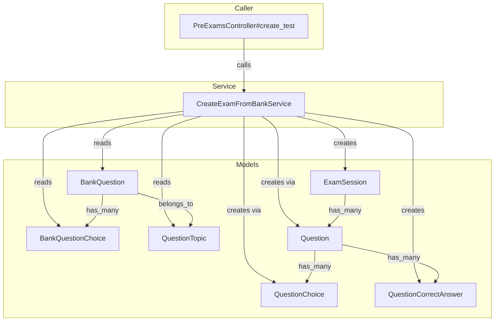
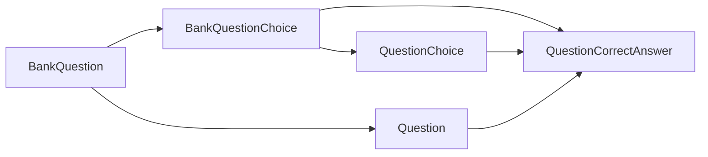

# C4 Code-Level Documentation: app-services

## 1. Overview Section

| Attribute | Value |
|-----------|-------|
| **Name** | app-services |
| **Description** | Service objects for the Ruby Prep Test Rails 8 application, responsible for creating exam sessions from a question bank. |
| **Location** | `src/app/services` |
| **Language** | Ruby |
| **Purpose** | Encapsulates business logic for generating exams from seeded bank questions. Provides a single service (`CreateExamFromBankService`) that creates an `ExamSession` with random questions and their choices, copied from `BankQuestion` records. |

---

## 2. Code Elements Section

### 2.1 CreateExamFromBankService

| Attribute | Value |
|-----------|-------|
| **Location** | [src/app/services/create_exam_from_bank_service.rb](../src/app/services/create_exam_from_bank_service.rb) |
| **Description** | Service object that creates a new exam session by randomly selecting questions from the question bank and copying them (including choices and correct answers) into the exam. |

#### Constants

| Constant | Value | Description |
|----------|-------|-------------|
| `EXAM_QUESTIONS_COUNT` | `50` | Default number of questions per exam |
| `DEFAULT_TITLE` | `"Ruby 3.1.x Silver Exam"` | Default exam title |
| `DEFAULT_TIME_LIMIT` | `60 * 60` (3600 seconds) | Default time limit (1 hour) |
| `DEFAULT_NUMBER_PASS` | `40` | Minimum correct answers to pass |

#### Nested Classes

| Class | Location | Description |
|-------|----------|-------------|
| `CreateExamFromBankService::Error` | Line 4 | Custom exception raised when the question bank has insufficient questions |

#### Methods

##### `#initialize(questions_count: EXAM_QUESTIONS_COUNT)`

- **Signature**: `initialize(questions_count: Integer) -> void`
- **Parameters**:
  - `questions_count` (Integer, optional): Number of questions to include in the exam. Defaults to `EXAM_QUESTIONS_COUNT` (50).
- **Returns**: void
- **Description**: Sets the number of questions to sample from the bank.

##### `#call`

- **Signature**: `call -> Hash{Symbol => Object}`
- **Returns**: `Hash` with keys:
  - `:exam_session` (ExamSession): The created exam session
  - `:hash_id` (String): Unique identifier for the exam (8-byte hex from SecureRandom)
- **Raises**: `CreateExamFromBankService::Error` if the question bank has fewer than `@questions_count` questions
- **Description**: Main entry point. Loads bank questions, creates an `ExamSession`, copies questions and choices, and returns the session and hash_id. Runs inside a database transaction.

##### `#copy_to_exam(exam_session, bank_question)` (private)

- **Signature**: `copy_to_exam(exam_session: ExamSession, bank_question: BankQuestion) -> void`
- **Parameters**:
  - `exam_session` (ExamSession): The target exam session
  - `bank_question` (BankQuestion): Source question from the bank
- **Returns**: void
- **Description**: Copies a single bank question into the exam: creates a `Question`, its `QuestionChoice` records, and `QuestionCorrectAnswer` records.

---

## 3. Dependencies Section

### 3.1 Internal Dependencies (within the repository)

| Dependency | Type | Location | Usage |
|------------|------|----------|-------|
| `BankQuestion` | Model | `src/app/models/bank_question.rb` | Source questions for the exam |
| `BankQuestionChoice` | Model | `src/app/models/bank_question_choice.rb` | Choices for bank questions |
| `QuestionTopic` | Model | `src/app/models/question_topic.rb` | Topic for each bank question |
| `ExamSession` | Model | `src/app/models/exam_session.rb` | Target exam session |
| `Question` | Model | `src/app/models/question.rb` | Exam questions (created via `exam_session.questions`) |
| `QuestionChoice` | Model | `src/app/models/question_choice.rb` | Choices for exam questions |
| `QuestionCorrectAnswer` | Model | `src/app/models/question_correct_answer.rb` | Maps questions to correct choices |

**Caller (optional relationship)**:

| Caller | Location | Usage |
|--------|----------|-------|
| `PreExamsController` | `src/app/controllers/pre_exams_controller.rb` | `PreExamsController#create_test` invokes `CreateExamFromBankService.new.call` |

### 3.2 External Dependencies

| Dependency | Type | Usage |
|------------|------|-------|
| `Rails` | Framework | ActiveRecord, transaction support |
| `ActiveRecord` | ORM | Models, associations, transactions |
| `SecureRandom` | Ruby stdlib | `SecureRandom.hex(8)` for hash_id generation |

---

## 4. Relationships Section

### 4.1 Data Flow Diagram

### 4.2 Copy Flow (copy_to_exam)

---

## 5. Source Code References

| Element | File Path |
|---------|-----------|
| Service | `src/app/services/create_exam_from_bank_service.rb` |
| Controller caller | `src/app/controllers/pre_exams_controller.rb` (lines 10–12) |
| BankQuestion | `src/app/models/bank_question.rb` |
| BankQuestionChoice | `src/app/models/bank_question_choice.rb` |
| QuestionTopic | `src/app/models/question_topic.rb` |
| ExamSession | `src/app/models/exam_session.rb` |
| Question | `src/app/models/question.rb` |
| QuestionChoice | `src/app/models/question_choice.rb` |
| QuestionCorrectAnswer | `src/app/models/question_correct_answer.rb` |
