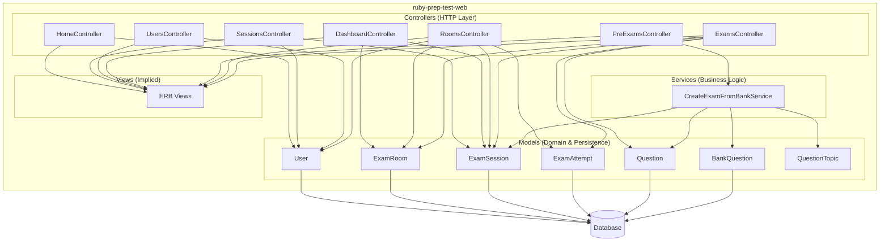

# C4 Component-Level Documentation: ruby-prep-test-web

## 1. Overview Section

| Attribute | Value |
|-----------|-------|
| **Name** | ruby-prep-test-web |
| **Description** | The core Rails monolithic application. |
| **Type** | Web Application |
| **Technology** | Ruby on Rails 8, Hotwire (Turbo/Stimulus) |

---

## 2. Purpose Section

### What This Component Does

ruby-prep-test-web is the main web application for a Ruby exam prep system. It handles:

- **User management** — Registration, authentication, and role-based access (user vs host)
- **Exam creation** — Generating exam sessions from a question bank of Ruby topics
- **Exam scheduling** — Creating and managing exam rooms with start times and durations
- **Exam taking** — Candidates joining rooms, answering questions, and submitting answers
- **Results and scoring** — Host results and leaderboards, CSV export, and candidate result views

### Problems It Solves

- **Proctored exams** — Rooms with scheduled start times and time limits
- **Question randomization** — Shuffled questions per room/attempt
- **Real-time updates** — Live participant counts via Turbo Streams
- **Multi-role flow** — Hosts create and manage exams; users take exams

### Role in the System

This component is the primary user-facing application. It exposes HTTP routes for authentication, exam creation, room management, and exam taking, and coordinates models and services to implement the domain logic.

---

## 3. Software Features Section

| Feature | Description |
|---------|-------------|
| **User Management** | Sign up, sign in, sign out; role-based access (user/host) |
| **Exam Creation** | Create exam sessions from question bank via `CreateExamFromBankService` |
| **Exam Room Scheduling** | Create, view, start, and delete rooms; set start time and duration |
| **Exam Taking** | Join by room code or exam code; answer questions; submit and view results |
| **Host Dashboard** | List rooms created by the host; manage rooms |
| **Live Participant Tracking** | Real-time participant counts and submission status via Turbo Streams |
| **Results & Leaderboard** | Host: leaderboard, CSV export; candidate: score and details |
| **Join by Room Code** | Home page flow to join exams via room code |

---

## 4. Code Elements Section

| Source | Description |
|--------|-------------|
| **C4-Documentation/c4-code-app-models.md** | ActiveRecord models: User, QuestionTopic, BankQuestion, BankQuestionChoice, ExamSession, Question, QuestionChoice, QuestionCorrectAnswer, ExamRoom, ExamAttempt. Domain entities, associations, validations, and business logic. |
| **C4-Documentation/c4-code-app-controllers.md** | HTTP controllers: ApplicationController, HomeController, SessionsController, UsersController, DashboardController, PreExamsController, RoomsController, ExamsController. Request handling, auth, and routing. |
| **C4-Documentation/c4-code-app-services.md** | Service objects: CreateExamFromBankService. Business logic for generating exams from the question bank. |

---

## 5. Interfaces Section

### HTTP Routes (Component Interfaces)

| Route | HTTP | Controller#Action | Description |
|-------|------|-------------------|-------------|
| `/` | GET | HomeController#index | Landing page |
| `/join` | GET | HomeController#join | Join by room code |
| `/dashboard` | GET | DashboardController#index | Host dashboard |
| `/login` | GET | SessionsController#new | Login form |
| `/login` | POST | SessionsController#create | Authenticate |
| `/logout` | DELETE | SessionsController#destroy | Sign out |
| `/signup` | GET | UsersController#new | Signup form |
| `/signup` | POST | UsersController#create | Register user |
| `/pre_exams` | GET | PreExamsController#index | Exam creation form |
| `/pre_exams/created` | GET | PreExamsController#created | Exam creation success |
| `/pre_exams/create_test` | POST | PreExamsController#create_test | Create exam from bank |
| `/exams` | GET | ExamsController#index | Exam taking / entry |
| `/exams` | POST | ExamsController#create | Submit answers |
| `/exams/:id` | GET | ExamsController#show | View result |
| `/rooms/new` | GET | RoomsController#new | Room creation form |
| `/rooms` | POST | RoomsController#create | Create room |
| `/rooms/:room_code` | GET | RoomsController#show | Room view |
| `/rooms/:room_code` | DELETE | RoomsController#destroy | Delete room |
| `/rooms/:room_code/start_now` | PATCH | RoomsController#start_now | Start exam now |
| `/rooms/:room_code/participants` | GET | RoomsController#participants | Participants JSON |
| `/rooms/:room_code/results` | GET | RoomsController#results | Results (HTML/CSV) |

### Flow Summary

- **Controllers** receive HTTP requests and delegate to **Services** or **Models**.
- **Views** are rendered by Controllers (implied in the MVC flow).
- Controllers orchestrate: Services (e.g. CreateExamFromBankService), Models (e.g. User, ExamRoom, ExamAttempt).

---

## 6. Dependencies Section

### Internal Components (Within ruby-prep-test-web)

| Component | Usage |
|-----------|-------|
| **app-models** | Domain entities, persistence, validations, associations |
| **app-services** | Encapsulated business logic (exam creation) |
| **app-controllers** | Request handling, auth, and routing |
| **app-views** | ERB templates (implied from controller references) |

### External Systems

| Dependency | Purpose |
|------------|---------|
| **PostgreSQL/SQLite** | Database (ActiveRecord) |
| **Rails 8** | Web framework, routing, params, session |
| **Turbo** | Turbo Streams for live participant updates |
| **bcrypt** | Password hashing |
| **SecureRandom** | Tokens (room_code, attempt_token, hash_id) |
| **CSV** (stdlib) | CSV export for results |

---

## 7. Component Diagram



### Request Flow Summary

```
HTTP Request → Controller → Service (if needed) / Model → View (render) → HTTP Response
```
